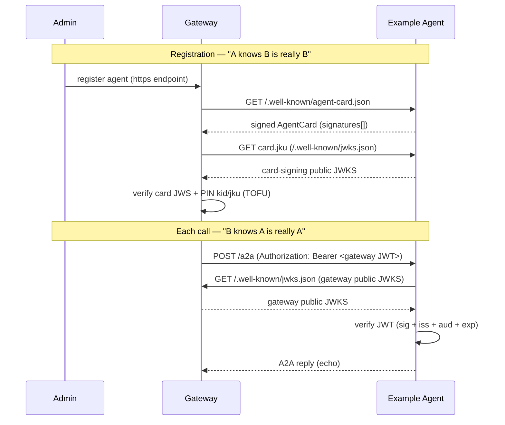

# Architecture

## The contract (both directions)

This agent therefore does three things:

1. **Serves a signed AgentCard** at `/.well-known/agent-card.json`. The card is
   signed with a detached-payload EdDSA flattened JWS over its **canonical JSON**
   (see [`src/auth/canonical.ts`](src/auth/canonical.ts)). The gateway verifies this and
   pins the signing key's `kid` + `jku` on first registration (Trust-On-First-Use).
2. **Publishes its card-signing public JWKS** at `/.well-known/jwks.json` (the
   card's `jku`), so the gateway can resolve the signing key.
3. **Verifies the gateway identity JWT** on every JSON-RPC call, resolving the
   gateway's public JWKS from the token's own `jku` header (RFC 7515 §4.1.2)
   and enforcing `iss`, `aud`, and `exp` against `GATEWAY_ORIGINS`.
   The verified caller identity is read from the namespaced
   `https://looping.ai/identity` claim and echoed back.

> No secret is shared in either direction. The gateway proves it is the gateway
> with a signed JWT; this agent proves it is itself with a signed card. Each side
> only needs the other's **public** JWKS.

## Canonical JSON (must match the gateway)

The card signature is computed over a deterministic serialization:

- object keys sorted recursively (ascending),
- `JSON.stringify` with no insignificant whitespace,
- the `signatures` field excluded,
- payload bytes = UTF-8, base64url (no padding) for the JWS.

[`src/auth/canonical.ts`](src/auth/canonical.ts) is a byte-for-byte copy of the gateway's
[`src/a2a/card-verify.ts`](https://github.com/Looping-AI/looping-gateway/blob/main/src/a2a/card-verify.ts) canonicalizer. **If you change one, change both.**

## Environment

| Variable          | Where  | Purpose                                                                                              |
| ----------------- | ------ | ---------------------------------------------------------------------------------------------------- |
| `A2A_SIGNING_KEY` | secret | Ed25519 private JWK (with `kid`) that signs the AgentCard.                                           |
| `GATEWAY_ORIGINS` | var    | JSON array of trusted gateway origins, e.g. `["https://gw.example.com"]`. Validates `jku` and `iss`. |

## Files

| File                                                     | Role                                                               |
| -------------------------------------------------------- | ------------------------------------------------------------------ |
| [`src/index.ts`](src/index.ts)                           | Worker entry: routes card / JWKS / JSON-RPC; verifies JWT.         |
| [`src/auth/card.ts`](src/auth/card.ts)                   | Build + sign the AgentCard; derive public JWKS; parse signing key. |
| [`src/auth/canonical.ts`](src/auth/canonical.ts)         | Canonical JSON contract (mirrors the gateway).                     |
| [`src/auth/verify.ts`](src/auth/verify.ts)               | Verify the gateway identity JWT.                                   |
| [`src/agent/executor.ts`](src/agent/executor.ts)         | Agent behavior — the Echo executor (swap this for a real agent).   |
| [`scripts/generate-keys.mjs`](scripts/generate-keys.mjs) | Ed25519 JWK keypair generator.                                     |
