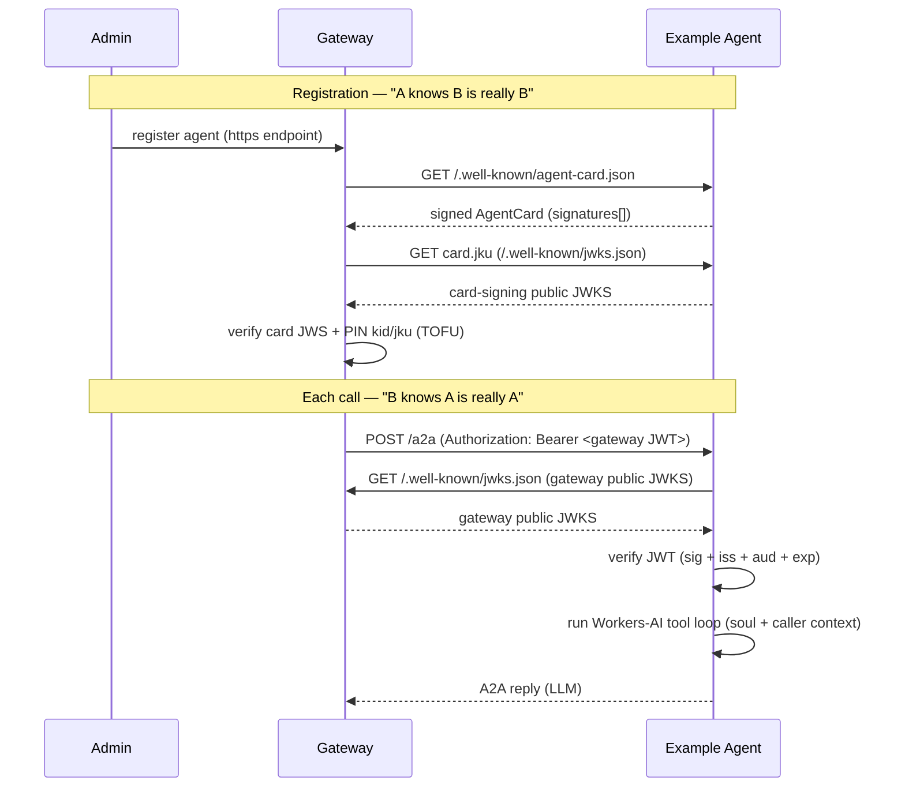

# Architecture

## The contract (both directions)

This agent therefore does three things:

1. **Serves a signed AgentCard** at `/.well-known/agent-card.json`. The card is
   signed with a detached-payload EdDSA flattened JWS over its **canonical JSON**
   (see [`src/auth/canonical.ts`](src/auth/canonical.ts)). The gateway verifies this and
   pins the signing key's `kid` + `jku` on first registration (Trust-On-First-Use).
2. **Publishes its card-signing public JWKS** at `/.well-known/jwks.json` (the
   card's `jku`), so the gateway can resolve the signing key.
3. **Verifies the gateway identity JWT** on every JSON-RPC call, resolving the
   gateway's public JWKS from the token's own `jku` header (RFC 7515 §4.1.2)
   and enforcing `iss`, `aud`, and `exp` against `GATEWAY_ORIGINS`.
   The verified caller identity is read from the namespaced
   `https://looping.ai/identity` claim and passed to the agent runtime.

> No secret is shared in either direction. The gateway proves it is the gateway
> with a signed JWT; this agent proves it is itself with a signed card. Each side
> only needs the other's **public** JWKS.

## Agent runtime (the LLM tool loop)

Once the JWT is verified, [`src/index.ts`](src/index.ts) hands the request to
[`LlmExecutor`](src/agent/executor.ts), which runs a **stateless** Workers-AI
tool loop for the turn:

- **Model pair** ([`src/agent/model.ts`](src/agent/model.ts)): a primary + fallback
  Workers-AI model (via [`workers-ai-provider`](https://www.npmjs.com/package/workers-ai-provider)
  routed through an AI Gateway). Model ids and the gateway slug are constants in
  [`src/agent/config.ts`](src/agent/config.ts).
- **Turn loop** ([`src/agent/loop.ts`](src/agent/loop.ts)): a bounded multi-step
  `generateText` loop (`stepCountIs(MAX_STEPS)`). If the primary model throws it
  retries once on the fallback; a transient (capacity/timeout) failure returns a
  friendly "try again" message. Always publishes exactly one agent message and
  calls `finished()`.
- **Soul + caller context** ([`src/agent/prompt.ts`](src/agent/prompt.ts)): a frozen
  identity/operating-rules prompt, suffixed per request with the verified caller
  from the JWT. The prompt is aware of the gateway's `<turn>` provenance wrapper
  (parsed, never authored — see [`src/agent/messages.ts`](src/agent/messages.ts)).
- **Tools** ([`src/agent/tools.ts`](src/agent/tools.ts)): placeholder `whoami` /
  `echo` tools that prove tool-calling end to end. `whoami` closes over the
  verified identity so it can't be spoofed from model input. Real domain tools
  (with per-call authorization) come in a later phase.

Nothing is persisted yet — each turn is independent. Memory, episodic recall, and
real domain tools are subsequent phases (see [`PLAN.md`](PLAN.md)).

## Canonical JSON (must match the gateway)

The card signature is computed over a deterministic serialization:

- object keys sorted recursively (ascending),
- `JSON.stringify` with no insignificant whitespace,
- the `signatures` field excluded,
- payload bytes = UTF-8, base64url (no padding) for the JWS.

[`src/auth/canonical.ts`](src/auth/canonical.ts) is a byte-for-byte copy of the gateway's
[`src/a2a/card-verify.ts`](https://github.com/Looping-AI/looping-gateway/blob/main/src/a2a/card-verify.ts) canonicalizer. **If you change one, change both.**

## Environment

| Variable          | Where   | Purpose                                                                                              |
| ----------------- | ------- | ---------------------------------------------------------------------------------------------------- |
| `A2A_SIGNING_KEY` | secret  | Ed25519 private JWK (with `kid`) that signs the AgentCard.                                           |
| `GATEWAY_ORIGINS` | secret  | JSON array of trusted gateway origins, e.g. `["https://gw.example.com"]`. Validates `jku` and `iss`. |
| `AI`              | binding | Workers AI binding (routed via AI Gateway) backing the LLM tool loop.                                |

## Files

| File                                                     | Role                                                                   |
| -------------------------------------------------------- | ---------------------------------------------------------------------- |
| [`src/index.ts`](src/index.ts)                           | Worker entry: routes card / JWKS / JSON-RPC; verifies JWT.             |
| [`src/auth/card.ts`](src/auth/card.ts)                   | Build + sign the AgentCard; derive public JWKS; parse signing key.     |
| [`src/auth/canonical.ts`](src/auth/canonical.ts)         | Canonical JSON contract (mirrors the gateway).                         |
| [`src/auth/verify.ts`](src/auth/verify.ts)               | Verify the gateway identity JWT.                                       |
| [`src/agent/executor.ts`](src/agent/executor.ts)         | `LlmExecutor` — wires the model pair, prompt, and tools into the loop. |
| [`src/agent/loop.ts`](src/agent/loop.ts)                 | Stateless turn runner (primary → fallback, transient handling).        |
| [`src/agent/model.ts`](src/agent/model.ts)               | Workers-AI primary/fallback model pair (via AI Gateway).               |
| [`src/agent/prompt.ts`](src/agent/prompt.ts)             | Soul (identity + rules) + per-request caller context.                  |
| [`src/agent/tools.ts`](src/agent/tools.ts)               | Placeholder `whoami` / `echo` tools (pure handlers + AI-SDK wiring).   |
| [`src/agent/messages.ts`](src/agent/messages.ts)         | A2A text extraction + `<turn>` provenance parsing.                     |
| [`src/agent/config.ts`](src/agent/config.ts)             | Model ids, AI Gateway slug, and loop step bound.                       |
| [`src/agent/manifest.ts`](src/agent/manifest.ts)         | AgentCard identity + advertised skills.                                |
| [`scripts/generate-keys.mjs`](scripts/generate-keys.mjs) | Ed25519 JWK keypair generator.                                         |
